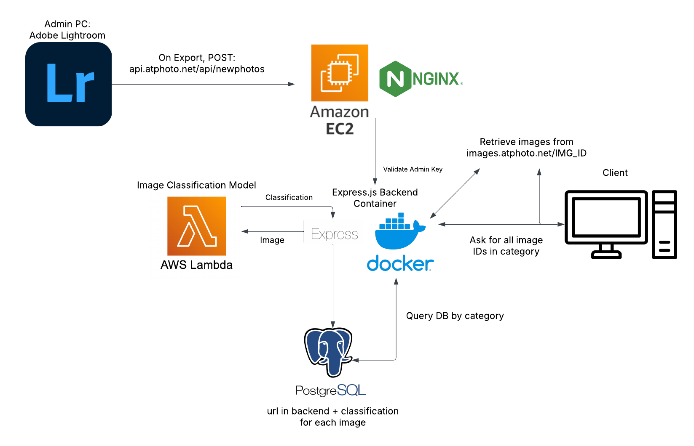

# at_photo | A technologically modern photography site.

This is the frontend repository for my photography site at: [https://atphoto.net](https://atphoto.net)

You can find the backend repository [here](https://github.com/m3di0cre3/at_photo_backend).

Demo video: [https://www.youtube.com/watch?v=gvs8uGo5pUo](https://www.youtube.com/watch?v=gvs8uGo5pUo)

## About ATPhoto

Tech Stack:

ATPhoto is a photography site that I am building to showcase my photography skills. I'm an avid photographer and a passionate software engineer and I wanted to combine the two.

The biggest problem for photography sites is the time it takes to add new content such as photos and blogs. As I'm currently a university student, I don't have much time to add new content. So, I designed my own image processing pipeline and implemented it myself.

And although a simple solution, I used React's capabilities to automatically generate blogs with the function taking a simple structured content schema.

Becomes this:

Lastly, the DevOps was a fun adventure where I learned a lot about AWS, and now have robust infrastructure set up with a functioning CI/CD pipeline (after being told by many to just use Vercel). The couple of all nighters I pulled for just my first deployment were worth it.

